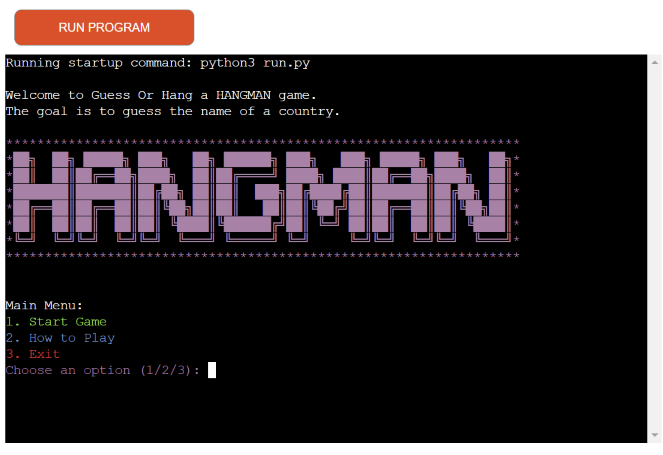
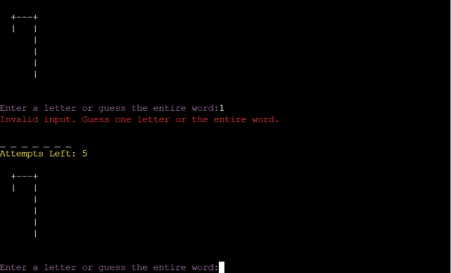
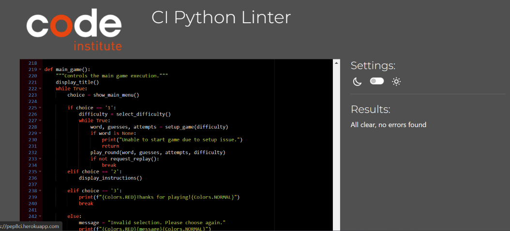

# GUESS OR HANG

Welcome to GUESS OR HANG a Hangman Game!
This is a classic word-guessing game where players try to guess a hidden word by
suggesting letters within a limited number of attempts.
The game is implemented in Python and uses Google Sheets to fetch words dynamically.


Find link to game here: <https://guess-or-hang-bc6bf8f00227.herokuapp.com/>

## Table of Contents

- [About the Project](#about-the-project)
- [Game Features](#game-features)
- [Technology Used](#technology-used)
- [Installation](#installation)
- [Usage](#usage)
- [Game Flowchart](#game-flowchart)
- [Game Instructions](#game-instructions)
- [Home Screen](#home-screen)
- [Objective](#objective)
- [How to Play](#how-to-play)
- [Starting the Game](#starting-the-game)
- [Selecting Difficulty](#selecting-difficulty)
- [Making a Guess](#making-a-guess)
- [Using Hints](#using-hints)
- [Winning the Game](#winning-the-game)
- [Losing the Game](#losing-the-game)
- [Replaying the Game](#replaying-the-game)
- [Exiting the Game](#exiting-the-game)
- [Testing](#testing)
- [CI Python Linter](#ci-python-linter)
- [Performance Checks](#performance-checks)
- [Bugs](#bugs)
- [Testing](#testing)
- [Performance Checks](#performance-checks)
- [BUGS](#bugs)
- [CREDITS](#credits)
- [SPECIAL THANKS](#special-thanks)

## About the Project

This Hangman game was developed as an educational project to demonstrate the use of Python for game development,
including the integration with Google Sheets for dynamic word selection. The game features colorful terminal output,
providing a fun and interactive way to play the classic game of Hangman. The game is suitable for anyone that enjoys challenge.

## Game Features

- **Dynamic Word Fetching**: Words are fetched from a Google Sheet, allowing for easy updates and changes to the word list.
- **Difficulty Levels**: Three difficulty levels (Easy, Medium, Hard) with varying numbers of allowed incorrect attempts.
- **Hints**: Players can request hints, which reveal a letter in the word at the cost of an attempt,
players must read the instructions to understand how to use the 'hint'.
- **Colorful Output**: The game uses ANSI escape codes to color the terminal output, enhancing the visual experience.
- **Victory and Defeat Screens**: Custom victory and defeat screens are displayed based on the game outcome.

## Technology Used

- **Python**: The core language used to develop the game.
- **Google Sheets API**: Used to fetch words dynamically from a Google Sheet.
- **Colorama**: A Python library used for cross-platform colored terminal text.
- **Heroku**: Deployment platform used for running the game in a live environment.

## Installation

### Prerequisites

- Python 3.x
- Google Cloud account with access to Google Sheets API
- Heroku CLI (for deployment)
- `creds.json`: Service account credentials for Google Sheets API

### Setup

1. **Clone the repository**:

    ```bash
    git clone https://github.com/OJarvey/guess-or-hang-pp3.git
    cd guess-or-hang
    ```

2. **Install dependencies**:

    ```bash
    pip3 freeze > requirements.txt
    ```

3. **Set up Google Sheets API**:
   - Enable the Google Sheets API and obtain the `creds.json` file.
   - Place the `creds.json` file in the root directory of the project.

4. **Run the game locally**:

    ```bash
    python run.py
    ```

5. **Deploy to Heroku**:

    1. Log in or sign up to Heroku and create a new app.
    2. Choose a unique name for your app.
    3. In the settings tab, reveal the config vars. Then enter a key name and the value you need from the google sheets json file. Which should include the following:
    - type
    - project_id
    - private_key_id
    - private_key
    - client_email
    - client_id
    - auth_url
    - token_url
    - auth_provider_x509_cert_url
    - client_x509_cert_url
    - universe_domain

- Click add to save.

    1. Below that, click "Add buildpack," select Python, and save.
    2. Click "Add buildpack" again, this time select Node.js and save.
    3. Ensure that Python is listed above Node.js in the buildpack order.
    4. Go to the deploy tab and select GitHub as the deployment method. Connect your GitHub account.
    5. When prompted, enter the repository you want to deploy, search for it, and once found, connect it.
    6. You can choose to set it for automatic deployment or do it manually.
  - Automatic deployment will occur every time you push something to GitHub.
  - Manual deployment gives you control over when the app should be deployed, but remember to do it yourself.

***
Once the app is built, Heroku will provide a link to the live web page.

- You can access the live game via the following URL: [Guess Or Hang](https://guess-or-hang-bc6bf8f00227.herokuapp.com/)
- You can access the GitHub Repository via the following URL: [Guess or Hang Repository](https://github.com/OJarvey/guess-or-hang-pp3.git)

### Usage

Once installed, you can run the game by executing the `python3 run.py` script in the terminal.
The game will start in the terminal, and you can follow the on-screen instructions to play.

## Game Flowchart

Here’s a visual representation of the game’s flow:


## Game Instructions

### Home Screen



### Objective

The goal of the Hangman game is to guess the hidden word by suggesting letters within a limited number of attempts.
Each incorrect guess brings the hangman closer to being fully drawn.
The game ends when the word is fully guessed, or when the hangman is completely drawn.

### How to Play

#### Starting the Game

- When the game starts, you'll be presented with a main menu.

- You can choose from three options:
   1. Start Game: Begin a new game.
   2. How to Play: View the game instructions.
   3. Exit: Close the game.
- To start a new game, select "Start Game" from the menu.

   

#### Selecting Difficulty

- After choosing to start the game, you'll be prompted to select a difficulty level:
  - Easy: 5 attempts allowed.
  - Medium: 3 attempts allowed.
  - Hard: 1 attempt allowed.
  - The difficulty level affects how many incorrect guesses you can make before the game ends.

   

#### Making a Guess

- The game will display a series of underscores ["_"], each representing a letter in the hidden word.

   

- You need to guess the letters of the word one at a time:
      - Correct Guess: If the guessed letter is in the word, it will be revealed in all the correct positions.

   

- Incorrect Guess: If the guessed letter is not in the word,
      one part of the hangman will be drawn, and you lose one attempt.


- You can also attempt to guess the entire word at once,
   but be careful, if your guess is wrong, it counts as an incorrect attempt.

   **Invalid Input**
- Error Message:
- The game will display a friendly error message when invalid input is detected, guiding the player to make a correct guess.
- No Penalty:
- Invalid inputs do not count as an incorrect guess, so the player does not lose an attempt for entering invalid data.

   

#### Using Hints

- If you're stuck, you can type 'hint' to reveal one of the hidden letters in the word.
- Using a hint will cost you one attempt, so use it wisely.
- Hints are only available if you have more than one attempt left.

#### Winning the Game

- You win the game by guessing all the letters in the word correctly before running out of attempts.
- When you win, a victory screen will be displayed, congratulating you on your success and asking if you want to play again.

   

#### Losing the Game

- If you run out of attempts before guessing the word, the game ends, and the hangman is fully drawn.
- A defeat screen will be displayed, showing the correct word and asking if you want to play.

   

#### Replaying the Game

- After the game ends, whether you win or lose, you will be asked if you want to play again.
- Type y to start a new game or n to exit.

   

#### Exiting the Game

- You can exit the game at any time by selecting "Exit" from the main menu or by choosing not to replay after a game ends.

## Testing

### CI Python Linter

- To maintain clean and consistent code, I leveraged the PEP8 checker, an essential tool for adhering to Python's style guidelines.
By using Code Institute's Python Linter, I was able to seamlessly submit my code for review.
The linter thoroughly analyzed various aspects of the codebase, including indentation, variable naming, and overall structure.
This process not only enhances readability and maintainability but also reinforces best practices in Python development.
Thanks to the PEP8 checker, my code is both functional and aligned with industry-standard coding conventions.

***Run.py***



***Vistuals.py***


### Performance Checks

- Lighthouse performance check tool was used to ensure the site performs well in browser.

   

## BUGS

***Bugs Encountered and How They Were Fixed***

During the development of the Hangman game, several bugs were identified and resolved to ensure a smooth gameplay experience. Below are some of the significant issues encountered and the steps taken to fix them:

1. Issue: Incorrect Handling of Repeated Letters

   - Description: The game initially did not properly handle scenarios where the player guessed a letter that appeared multiple times in the word. This resulted in only one instance of the letter being revealed, leaving other occurrences hidden.

   - Solution: The loop responsible for checking guessed letters was modified to iterate through the entire word and reveal all instances of the guessed letter. This ensured that each correct letter was displayed in all its correct positions.

2. Issue: Case Sensitivity in Guesses

   - Description: The game was initially case-sensitive, meaning that guessing a lowercase letter (e.g., a) would not match an uppercase letter in the word (e.g., A). This led to confusion and incorrect results.

   - Solution: To address this, all user inputs and the target word were converted to lowercase before processing. This change ensured that the game treated a and A as the same letter, regardless of the case.

3. Issue: Improper Handling of Non-Alphabetical Input

   - Description: Players could accidentally or intentionally enter numbers, symbols, or multiple characters at once, which caused the game to behave unpredictably or crash.

   - Solution: Input validation was implemented to ensure that only single alphabetical characters were accepted. If the input did not meet these criteria, the game would display an error message and prompt the player to enter a valid guess.

4. Issue: Hints Reducing Attempts Even When Word Was Already Complete

   - Description: The game allowed players to use hints even after the word had been completely guessed, which unnecessarily reduced the remaining attempts and created confusion.

   - Solution: Logic was added to check whether the word was already fully guessed before allowing a hint to be used. If the word was complete, the hint option was disabled, and no attempts were deducted.

***Unfixed Bugs***

At present, there are no known bugs in the application. It has undergone rigorous testing to ensure a smooth user experience.

### CREDITS

- [ASCII ART] (<https://www.asciiart.eu/text-to-ascii-art>) - This tool was utilized to map out and conceptualize the overall structure of the game.
- [Python Linter] (<https://pep8.org/>) - This tool was used to validate and clean code.
- [Flowchart] (<https://app.diagrams.net/>) - This tool was used for the flowchart.
- [Stack Overflow](https://stackoverflow.com/questions/287871/how-do-i-print-colored-text-to-the-terminal) - This source provided guidance on how
to print colored text to the terminal, which was implemented in the game for visual enhancement.
- [Hangman Youtube Tutorial](https://www.youtube.com/watch?v=m4nEnsavl6w&t=155s&ab_channel=Kite) - This tutorial provided valuable insights and inspiration during the conceptual development of the Hangman game.
- [Grammarly](https://app.grammarly.com/) - This tool was used for suggestions and correcting grammar errors.

## SPECIAL THANKS

I would like to extend my heartfelt gratitude to Code Institute for their invaluable help and support throughout this project.
Their resources and guidance were instrumental in bringing this game to life.

A special thanks goes to my mentor Spencer Barriball, whose encouraging words and unwavering support kept me motivated,
especially during moments when the challenges felt overwhelming. Your guidance has been truly inspiring.

I am also deeply grateful to my family and friends for their continuous support and encouragement.
Your belief in me has been a driving force, and I couldn’t have done this without you.
